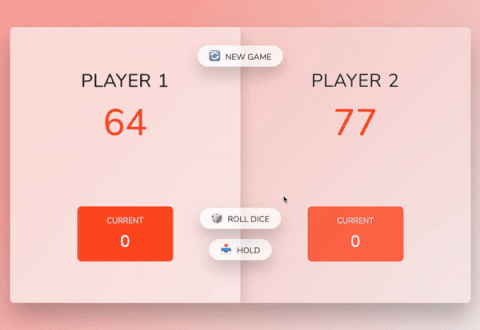

# DICE Game

## Introduction
A simple dice game with following rules. 

### Game rules
1) The game has 2 players, playing in rounds. In each turn, a player rolls two dices as many times as he whishes. Each result get added to his ROUND score.

2) But, if the player rolls one of the dices as 1, all his ROUND score gets lost. After that, it's the next player's turn

3) The player can choose to 'Hold', which means that his ROUND score gets added to his GLOBAL score. After that, it's the next player's turn. The first player to reach 100 points on GLOBAL score wins the game

4) The score is PREDEFINED to 100. An input field "Final Score" where players can set the winning score, so that they can change the predefined score of 100.

### Demo

### Credit
Icon made by Freepik from www.flaticon.com

**Free Game, Enjoy!**